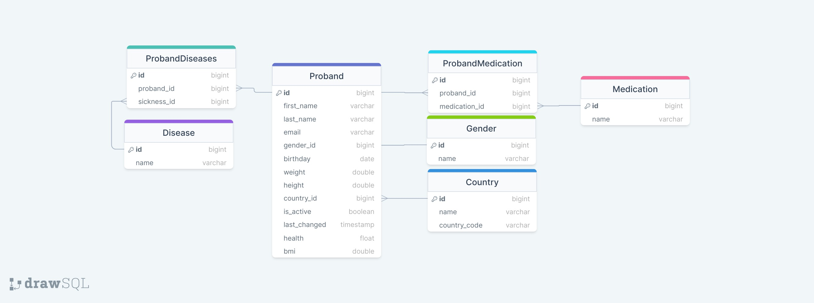

# Database Documentation

## Entity-Relationship-Model

The following diagram shows the entity-relationship-model of the database.

## Schema

**Medication**(<ins>id</ins>: BIGINT, name: VARCHAR(255)),

**Gender**(<ins>id</ins>: BIGINT, name: VARCHAR(255)), 

**Country**(<ins>id</ins>: BIGINT, name: VARCHAR(255), countrycode: VARCHAR(255)), 

**Disease**(<ins>id</ins>: BIGINT, name: VARCHAR(255)), 

**Proband**(<ins>id</ins>: BIGINT, first_name: VARCHAR(255), last_name: VARCHAR(255), email: VARCHAR(255), gender_id: BIGINT, birthday: DATE, weight: DOUBLE(8, 2), height: DOUBLE(8, 2), health: FLOAT, bmi: DOUBLE(8, 2), country_id: BIGINT, is_active: BOOLEAN, last_changed: TIMESTAMP), FK: country_id --> Country.id, gender_id --> Gender.id

**ProbandMedication**(<ins>id</ins>: BIGINT, proband_id: BIGINT, medication_id: BIGINT), FK: proband_id --> Proband.id, medication_id --> Medication.id

**ProbandDiseases**(<ins>id</ins>: BIGINT, proband_id: BIGINT, sickness_id: BIGINT), FK: proband_id --> Proband.id, sickness_id --> Disease.id

## Contributors
Jannik Loth (Matrikelnr. 3584453)

Annika Jung (Matrikelnr. 5717275)

